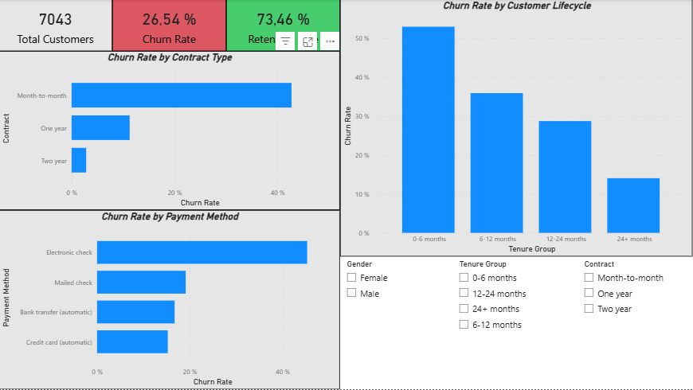

# 📊 Customer Churn Analysis (SaaS)

## 📌 Overview

This project analyzes customer churn in a SaaS environment to identify **when**, **why**, and **which customers** are most likely to leave.

The goal is to transform raw customer data into **actionable business insights** that help improve retention and reduce churn.

---

## 🎯 Business Problem

A SaaS company is experiencing customer churn and wants to understand:

* Why customers are leaving
* When churn occurs
* How to proactively reduce it

The objective is to identify **behavioral patterns and risk signals** associated with churn.

---

## 🎯 Objective

The goal of this project is to analyze customer churn by identifying key behavioral and usage patterns that lead to customer attrition.

This analysis aims to generate **actionable insights** to:

* Reduce churn
* Improve customer retention
* Optimize engagement strategies

---

##  Key Questions

### 1. What is the current churn rate?

* **Insight:**
  The overall churn rate is approximately **26.54%**, establishing a baseline for retention performance.

* **Decision:**
  Customer retention is a critical business challenge.

* **Recommendation:**
  Focus retention efforts on high-risk segments, especially early-stage users.

---

### 2. When are customers most likely to churn?

* **Insight:**
  Churn is significantly higher during the **first 6 months**.

* **Decision:**
  The onboarding phase is the most critical period.

* **Recommendation:**
  Improve onboarding, user education, and early engagement.

---

### 3. What behavioral patterns precede churn?

* **Insight:**
  Customers who churn tend to have **lower tenure and different spending patterns**.

* **Decision:**
  Reduced engagement is a strong churn indicator.

* **Recommendation:**
  Monitor engagement and trigger alerts on declining activity.

---

### 4. Which customer segments are at highest risk?

* **Insight:**
  Customers with **month-to-month contracts** show the highest churn rates.

* **Decision:**
  Low-commitment users are the most vulnerable segment.

* **Recommendation:**
  Promote long-term plans through incentives and added value.

---

### 5. Can we identify early warning signals of churn?

* **Insight:**
  Variables like **tenure, contract type, and spending** are strong predictors.

* **Decision:**
  Churn can be predicted before it happens.

* **Recommendation:**
  Deploy predictive models and proactive retention strategies.

---

## 🧪 Hypotheses Testing

H1: Low engagement increases churn
Status: Partially Supported
Explanation: Indirect indicators suggest lower engagement leads to churn

H2: Activity decreases before churn
Stauts: Not Testable
Explanation: No time-series data available

H3: Low adoption leads to early churn
Status: Supported
Explanation: High churn in early tenure confirms this

H4: Plan type affects churn
Stautus: Strongly Supported
Explanation: Month-to-month contracts show highest churn

H5: Time since last activity predicts churn
Status: Not Testable
Explanation: Dataset lacks activity timestamps

---

## 📊 Key Insights

* **Churn Rate:** 26.54% baseline
* **Contract Impact:** Month-to-month users churn significantly more
* **Lifecycle Effect:** Highest churn occurs in the first 6 months
* **Spending Behavior:** Revenue level influences churn patterns
* **Payment Method:** Some payment methods correlate with higher churn

### 🔥 Final Insight

> Early-stage customers on month-to-month contracts represent the highest churn risk and should be the primary focus of retention strategies.

---

## 🛠️ Tools & Technologies

* **SQL** → Data cleaning, cohort analysis, churn metrics
* **Python (Pandas, Scikit-learn)** → Behavioral analysis & churn modeling
* **Excel** → Validation and exploratory checks
* **Power BI** → Interactive dashboard and storytelling

---

## 📈 Dashboard

The Power BI dashboard provides an interactive view of customer churn, allowing dynamic exploration of high-risk segments.

### Key Features:
- Churn Rate KPIs  
- Churn by Contract Type  
- Churn by Customer Lifecycle  
- Churn by Payment Method  
- Interactive filters (slicers)

### 📸 Dashboard Preview



---

## 🧠 Key Learnings

* Early customer experience is critical for retention
* Contract type is one of the strongest churn drivers
* Data limitations affect hypothesis validation
* Combining SQL + Python + BI tools creates stronger insights

---

## 🚀 Business Recommendations

* Improve onboarding experience
* Incentivize long-term contracts
* Monitor early-stage customers closely
* Implement churn prediction systems

---

## 📁 Project Structure

```bash
├── Data/
│   ├── telco_customer_churn.csv
│   └── telco_churn_clean.csv
├── SQL/
│   └── churn_analysis.sql
├── Notebooks/
│   ├── churn_analysis.ipynb
│   └── data_cleaning.ipynb
├── Dashboard/
│   └── churn_dashboard.pbix
├── Images/
│   └── dashboard.png
└── README.md
```

---

## 👤 Author

**Fausto Gallo**

---

## ⭐ Final Note

This project demonstrates end-to-end data analysis:

> From raw data → to insights → to business decisions

---
